# Urban Traffic Simulator

A C++ Object-Oriented software application that simulates traffic movement within a virtual city environment.

## 1. Title & Description

**Urban Traffic Simulator** is a C++17 / Object-Oriented desktop application that simulates realistic urban traffic within a virtual city. It models a graph-based road network (intersections, multi-lane roads, roundabouts, bridges, tunnels), heterogeneous vehicle types with independent physics (Car, Bus, Motorbike, EmergencyVehicle), signalized/unsignalized junction arbitration, a public-transit (bus) subsystem, dynamic traffic events (accidents, congestion, road closures), and three interchangeable route-planning algorithms (BFS, Dijkstra, A*). A real-time SFML + Dear ImGui front end renders the network and vehicles, exposes a live control HUD, and supports snapshot-based time-travel (rewind/forward) through simulation history.

The project was built as a group assignment for an Object-Oriented Programming course, and its architecture is deliberately organized to demonstrate core OOP principles — **Abstraction**, **Inheritance**, **Polymorphism**, and **Encapsulation** — together with well-known design patterns (Strategy, Factory Method, Memento, Observer, Composite, Singleton, Facade).

## 2. Tech Stack

| Category | Technology |
|---|---|
| Language | C++17 |
| Build system | CMake ≥ 3.15 (`FetchContent` for dependency management) |
| Graphics / Windowing | [SFML 2.6.1](https://www.sfml-dev.org/) (graphics, window, system modules) |
| Immediate-mode GUI | [Dear ImGui v1.89.9](https://github.com/ocornut/imgui) + [imgui-sfml v2.6](https://github.com/SFML/imgui-sfml) (built as a local static library) |
| JSON parsing | [nlohmann/json v3.11.3](https://github.com/nlohmann/json) — used to load/save map definitions |
| Rendering backend | OpenGL (required by SFML) |
| Testing | Lightweight custom `TestFramework.h` + CTest, 7 standalone test executables |
| Auxiliary tooling | Python + matplotlib (offline benchmark chart generation, not part of the C++ build) |

## 3. Architecture & Class Diagram

The codebase follows a **layered, modular OOP architecture**. Each layer only depends on the layers below it, which keeps routing, physics, and rendering independently testable.

| Layer | Directory | Responsibility |
|---|---|---|
| **Model — Vehicle** | `src/model/vehicle/` | `Vehicle` abstract base + `Car`/`Bus`/`Motorbike`/`EmergencyVehicle`, decomposed into 6 single-responsibility helper components (`components/`) |
| **Model — Infrastructure** | `src/model/infrastructure/` | `Graph`, `Road` (+ `Bridge`/`Tunnel`), `Lane`, `Intersection` (+ `Roundabout`), `TrafficLight`, `JunctionConnector`, `RoadGeometry`, `LaneMapping` |
| **Model — Motion/POI** | `src/model/` | `MotionPath` hierarchy (Straight/Bézier/Arc/Composite/Roundabout), `PointOfInterest` hierarchy (`SpawnPoint`/`Destination` subtrees) |
| **Algorithm** | `src/algorithm/` | `PathFindingStrategy` interface + `BFSStrategy`, `DijkstraStrategy`, `AStarStrategy` |
| **Simulation** | `src/simulation/` | `TrafficSimulator` engine, `EventManager`, `StatisticsManager`, `SnapshotManager`, `TimePlaybackController`, `VehicleSpawnPolicy`, `BusTripPlanner` |
| **Loader** | `src/loader/` | JSON → `Graph` construction (`MapParser`, `GraphBuilder`, `MapLoading`, `Mapload`, `DemoMap`) |
| **Visualization** | `src/visualization/` | `VisualizationEngine`, `VehicleSprite`, `VehicleAssets`, `Camera`, `Rendering`, `SimulatorFactory` |
| **UI** | `src/ui/` | `DebugConsole` (unified HUD/control center), `StatsPanel`, `VehicleInspector`, `MapFileDialog` |

### Design patterns in use

- **Strategy** — `PathFindingStrategy` lets `BFSStrategy` / `DijkstraStrategy` / `AStarStrategy` be swapped at runtime (even mid-simulation) without touching `Vehicle` or `TrafficSimulator` code.
- **Factory Method** — `VehicleFactory::createVehicle()` instantiates the correct `Vehicle` subclass from a `VehicleKind` enum; `SimulatorFactory::createDemoSimulator()` builds a ready-to-run `TrafficSimulator`.
- **Memento** — `SnapshotManager` is the *caretaker* holding a bounded ring buffer of `SimulationSnapshot` *mementos*; `TrafficSimulator::captureSnapshot()/restoreSnapshot()` is the *originator*, enabling full rewind/forward time-travel.
- **Facade / Command-like** — `TimePlaybackController` wraps `SnapshotManager` + `TrafficSimulator` behind a simple `rewind()/forward()/seek()` API.
- **Observer** — `EventManager::notifyAffectedVehicles()` broadcasts road-condition changes (accident, congestion, closure) so every affected `Vehicle` can reroute.
- **Composite** — `CompositePath` aggregates arbitrary `MotionPath` segments; `RoundaboutTraversalPath` composes entry/circulating/exit segments into one continuous path.
- **Singleton** — `VehicleAssets::instance()` lazily loads and caches vehicle textures exactly once.
- **Composition over inheritance (refactor highlight)** — `Vehicle` was refactored from a single 2,100+ line file into a coordinator that delegates to six focused, independently testable components: `VehicleDynamics` (speed integration), `CarFollowingModel` (gap/stopping-distance math), `LaneChangePolicy` (lane-change state machine), `JunctionTraversalState` (junction geometry/traversal), `RouteFollower` (route management/rerouting/U-turns), and `VehicleBehavior` (yielding, POI, signaling). `Vehicle`'s public API is 100% preserved, so `Car`/`Bus`/`Motorbike`/`EmergencyVehicle` and all call sites are untouched.
- **Template Method (implicit)** — `Vehicle::update()` drives a fixed algorithm (dynamics → junction handling → route following) while virtual hooks (`calculateCurrentSpeed()`, `shouldPauseAt()`, `onPauseStarted()`, `updatePause()`) are overridden per vehicle type (most visibly by `Bus` for dwell-time stops and `EmergencyVehicle` for priority requests).
- **State machine** — `MovementState` (`OnRoad → WaitingAtIntersection → TraversingJunction → OnRoad`), `SignalStage` (`GREEN → YELLOW → ALL_RED`), `BusTripState`, and `PoiMergePhase` all model explicit finite-state transitions.

### Class Diagram

```mermaid
classDiagram
    direction TB

    %% ===================== 1. VEHICLE MODEL LAYER =====================
    class Vehicle {
        <<abstract>>
        #int id
        #double baseSpeed
        #double currentSpeed
        #Road currentRoad
        #double progressOnCurrentRoad
        #vector~Road~ currentRoute
        #MovementState movementState_
        #VehicleDynamics vehicleDynamics
        #CarFollowingModel carFollowingModel
        #LaneChangePolicy laneChangePolicy
        #JunctionTraversalState junctionTraversalState
        #RouteFollower routeFollower
        #VehicleBehavior vehicleBehavior
        +calculateCurrentSpeed() double*
        +getAcceleration() double
        +getDeceleration() double
        +getVehicleKind() VehicleKind
        +hasTrafficPriority() bool
        +update(dt, graph, strategy, allowReroute)
        +setRoute(route)
        +recalculateRoute(graph, strategy) bool
        +performUTurn(graph, strategy) bool
        +captureSnapshot(snap, graph)
        +restoreSnapshot(snap, graph)
    }
    class Car {
        +calculateCurrentSpeed() double
        +getLength() double
    }
    class Bus {
        -BusService service_
        -BusStop nextStop
        -double dwellTimer
        -BusTripState tripState_
        +calculateCurrentSpeed() double
        +shouldPauseAt(pos, projected, pausePos) bool
        +updatePause(availableTime) PauseUpdateResult
    }
    class Motorbike {
        +calculateCurrentSpeed() double
        +canTurnRightOnRed() bool
    }
    class EmergencyVehicle {
        +calculateCurrentSpeed() double
        +hasTrafficPriority() bool
        +update(dt, graph, strategy, allowReroute)
    }
    class VehicleKind {
        <<enumeration>>
        Car
        Bus
        Motorbike
        Emergency
    }
    class VehicleFactory {
        +createVehicle(kind, id, speed, start, dest) Vehicle$
    }
    class VehicleDynamics {
        +updatePoseTransition(vehicle, dt)
        +applyLongitudinalUpdate(vehicle, targetSpeed, subDt)
    }
    class CarFollowingModel {
        +evaluate(vehicle, road, freeFlowSpeed, minGap, desiredGap) FollowDecision
    }
    class LaneChangePolicy {
        +assess(vehicle, road, laneIndex, rearSafety, minTTC) LaneChangeCandidate
        +isBetter(candidate, best) bool
        +usesDedicatedEdgeLane(movement) bool
    }
    class JunctionTraversalState {
        +beginTraversal(vehicle, mapping, intersection) bool
        +completeTraversal(vehicle, outgoingProgress)
        +advance(vehicle, availableTime) double
    }
    class RouteFollower {
        +recalculateRoute(vehicle, graph, strategy) bool
        +performUTurn(vehicle, graph, strategy) bool
        +advanceToNextRoad(vehicle) bool
    }
    class VehicleBehavior {
        +handleTrafficLightYield(vehicle, remainingTime)
        +handleEmergencyYield(vehicle, freeFlowSpeed)
        +handlePoiBehavior(vehicle, dt)
        +updateSignals(vehicle, dt)
    }

    Vehicle <|-- Car
    Vehicle <|-- Bus
    Vehicle <|-- Motorbike
    Vehicle <|-- EmergencyVehicle
    Vehicle *-- VehicleDynamics
    Vehicle *-- CarFollowingModel
    Vehicle *-- LaneChangePolicy
    Vehicle *-- JunctionTraversalState
    Vehicle *-- RouteFollower
    Vehicle *-- VehicleBehavior
    Vehicle ..> VehicleKind
    VehicleFactory ..> Vehicle : creates

    %% ===================== 2. INFRASTRUCTURE MODEL LAYER =====================
    class Graph {
        -unordered_map~int,Intersection~ intersections
        -unordered_map~int,Road~ roads
        -vector~PointOfInterest~ pois
        +addIntersection(intersection)
        +addRoad(road)
        +getNeighbors(intersectionId) vector~Road~
        +calculateDistance(startId, destId) double
        +addBusStation(station) bool
        +addBusService(service) bool
    }
    class Road {
        -int id
        -double distance
        -double speedLimit
        -double congestionLevel
        -vector~Lane~ lanes
        -vector~BusStop~ busStops
        +getSpeedLimit() double
        +getCongestionLevel() double
        +findLeader(laneIndex, self) Vehicle
        +getWeightedCost(speedPreference) double
        +blockLane(laneIndex)
        +isBridge() bool
        +isTunnel() bool
    }
    class Bridge {
        -double heightLimit
        -double weightLimit
        +isBridge() bool
    }
    class Tunnel {
        -double heightLimit
        +isTunnel() bool
    }
    class Lane {
        -int laneIndex
        -bool blocked
        -vector~Vehicle~ vehicles
        +addVehicle(v)
        +isBlocked() bool
    }
    class Intersection {
        -int id
        -vector~Road~ incomingRoads
        -unordered_map~int,TrafficLight~ trafficLights
        -unordered_map~int,Reservation~ occupants_
        +configureTrafficSignals(phases, green, yellow, red) bool
        +getMovementDecision(inRoad, inLane, outRoad, movement) JunctionDecision
        +getConnector(incoming, lane, outgoing, lane) JunctionConnector
        +tryEnterMovement(vehicleId, connector, gap) bool
        +requestEmergencyPriority(vehicleId, inRoad, inLane, outRoad, outLane, width, hold)
        +canEnterMovement(vehicleId, connector, gap) bool
        +isRoundabout() bool
    }
    class Roundabout {
        -double radiusMetres_
        -double roadWidthMetres_
        +canEnterMovement(vehicleId, connector, gap) bool
        +createConnector(incoming, lane, outgoing, lane) JunctionConnector
        +isRoundabout() bool
    }
    class TrafficLight {
        -LightState currentState
        -double remainingSeconds
        +canProceed() bool
        +mustStop() bool
    }
    class JunctionConnector {
        -MovementType movement_
        -MotionPath path_
        +getLength() double
        +sampleByDistance(distanceMetres) Pose2D
    }
    class TurnLanePolicy {
        <<utility>>
        +classify(incoming, outgoing) MovementType$
        +map(incoming, currentLane, outgoing, allowUTurn) LaneMapping$
    }

    Road <|-- Bridge
    Road <|-- Tunnel
    Road "1" *-- "many" Lane
    Road "1" o-- "0..*" BusStop
    Intersection <|-- Roundabout
    Intersection "1" *-- "many" TrafficLight
    Intersection "1" o-- "many" JunctionConnector : caches
    JunctionConnector o-- MotionPath
    JunctionConnector ..> TurnLanePolicy : derives movement
    Graph "1" o-- "many" Road
    Graph "1" o-- "many" Intersection
    Graph "1" o-- "many" PointOfInterest
    Graph "1" o-- "many" BusStation
    Graph "1" o-- "many" BusService

    %% ===================== 3. POI MODEL LAYER =====================
    class PointOfInterest {
        <<abstract>>
        #int id
        #POIType type
        #Road connectedRoad
        #double spawnWeight
        +isSpawnPoint() bool
        +isDestination() bool
        +getTypeLabel() string
    }
    class SpawnPoint {
        -int capacity
        +tryReserveSpawnSlot() bool
        +releaseSpawnSlot()
    }
    class Destination {
        -int parkingSpaces
    }
    class ParkingLot
    class BusStation {
        -string code_
        -Road departureRoad_
        +tryAcquireDepartureSlot() bool
        +isConfiguredTransitStation() bool
    }
    class HospitalSpawn
    class ResidentialArea
    class Restaurant
    class Cinema
    class Supermarket
    class TouristSpot

    PointOfInterest <|-- SpawnPoint
    PointOfInterest <|-- Destination
    SpawnPoint <|-- ParkingLot
    SpawnPoint <|-- BusStation
    SpawnPoint <|-- HospitalSpawn
    SpawnPoint <|-- ResidentialArea
    Destination <|-- Restaurant
    Destination <|-- Cinema
    Destination <|-- Supermarket
    Destination <|-- TouristSpot

    %% ===================== 4. MOTION / GEOMETRY (Composite Pattern) =====================
    class MotionPath {
        <<abstract>>
        +getLength() double*
        +sampleByDistance(distanceMetres) Pose2D*
    }
    class StraightLanePath
    class BezierJunctionPath {
        -vector~ArcSample~ arcTable_
    }
    class CircularArcPath
    class CompositePath {
        -vector~MotionPath~ segments_
        -vector~double~ cumulativeLengths_
    }
    class RoundaboutTraversalPath {
        -CompositePath path_
        -double circulatingRadiusMetres_
    }
    MotionPath <|-- StraightLanePath
    MotionPath <|-- BezierJunctionPath
    MotionPath <|-- CircularArcPath
    MotionPath <|-- CompositePath
    MotionPath <|-- RoundaboutTraversalPath
    CompositePath o-- MotionPath : composes segments
    RoundaboutTraversalPath *-- CompositePath

    %% ===================== 5. ALGORITHM LAYER (Strategy Pattern) =====================
    class PathFindingStrategy {
        <<interface>>
        +findPath(graph, startId, goalId) PathResult*
        +name() string*
    }
    class BFSStrategy {
        +findPath(graph, startId, goalId) PathResult
        +name() string
    }
    class DijkstraStrategy {
        -double speedPreference_
        +findPath(graph, startId, goalId) PathResult
        +setSpeedPreference(pref)
    }
    class AStarStrategy {
        +findPath(graph, startId, goalId) PathResult
    }
    PathFindingStrategy <|.. BFSStrategy
    PathFindingStrategy <|.. DijkstraStrategy
    PathFindingStrategy <|.. AStarStrategy
    RouteFollower ..> PathFindingStrategy : uses
    Road ..> PathFindingStrategy : supplies edge cost

    %% ===================== 6. SIMULATION LAYER =====================
    class TrafficSimulator {
        -Graph graph
        -PathFindingStrategy pathFindingStrategy
        -vector~Vehicle~ vehicles
        -deque~PendingVehicle~ pendingVehicles
        -EventManager eventManager
        -StatisticsManager statisticsManager
        -SnapshotManager snapshotManager_
        -TimePlaybackController playbackController_
        +addVehicle(vehicle) bool
        +update(dt)
        +setPathFindingStrategy(strategy)
        +captureSnapshot() SimulationSnapshot
        +restoreSnapshot(snapshot) bool
    }
    class EventManager {
        -vector~TrafficEvent~ activeEvents
        +triggerEvent(event)
        +update(dt)
        +notifyAffectedVehicles(roadId)
    }
    class TrafficEvent {
        <<abstract>>
        #int roadId
        #double duration
        +apply(graph)*
        +remove(graph)*
        +getEventType() string*
    }
    class CongestionEvent {
        -double severity
        +apply(graph)
    }
    class AccidentEvent {
        -int laneIndex
        +apply(graph)
    }
    class RoadClosureEvent {
        +apply(graph)
    }
    class StatisticsManager {
        -unordered_map~string,AlgorithmMetric~ algorithmMetrics
        -unordered_map~int,TravelMetric~ travelMetrics
        +measurePathfinding(strategy, graph, startId, goalId) PathResult
        +recordVehicleTravel(vehicleId, dt)
        +recordRecalculation(vehicleId)
        +getSummary() StatisticsSummary
    }
    class SnapshotManager {
        -deque~SimulationSnapshot~ snapshots_
        +capture(simulator) size_t
        +restore(simulator, index) bool
    }
    class TimePlaybackController {
        -TrafficSimulator simulator_
        -SnapshotManager manager_
        +rewind(frames) size_t
        +forward(frames) size_t
        +seek(index) size_t
        +applyPendingSeek() bool
    }
    class VehicleSpawnPolicy {
        -Graph graph_
        -DemandWeights weights_
        +selectVehicleKind(includeGenericBus) VehicleKind
        +selectTrip(kind) Trip
    }
    class BusTripPlanner {
        +buildRandomPlan(graph, strategy, service, stops, engine, minStops, maxStops, departTime) BusTripPlan$
    }

    TrafficSimulator "1" *-- "1" EventManager
    TrafficSimulator "1" *-- "1" StatisticsManager
    TrafficSimulator "1" *-- "1" SnapshotManager
    TrafficSimulator "1" *-- "1" TimePlaybackController
    TrafficSimulator "1" o-- "many" Vehicle
    TrafficSimulator --> Graph
    TrafficSimulator --> PathFindingStrategy
    EventManager "1" o-- "many" TrafficEvent
    TrafficEvent <|-- CongestionEvent
    TrafficEvent <|-- AccidentEvent
    TrafficEvent <|-- RoadClosureEvent
    SnapshotManager --> TrafficSimulator : captures/restores (Memento)
    TimePlaybackController --> SnapshotManager
    TimePlaybackController --> TrafficSimulator
    VehicleSpawnPolicy --> Graph
    BusTripPlanner ..> BusTripPlan : creates

    %% ===================== BUS SUBSYSTEM =====================
    class BusService {
        -vector~Road~ roadRoute_
        -vector~BusStop~ orderedStops_
        +getRoadRoute() vector~Road~
        +getOrderedStops() vector~BusStop~
    }
    class BusStop {
        -Road road_
        -double positionOnRoad_
        +getPositionOnRoad() double
    }
    class BusTripPlan {
        +vector~Road~ roadRoute
        +vector~BusStop~ orderedStops
        +double scheduledDepartureTime
    }
    Bus --> BusService : assigned to
    Bus --> BusStop : tracks next stop
    BusService --> BusStation : origin/destination
    BusService "1" o-- "many" BusStop
    BusTripPlanner ..> BusService

    %% ===================== 7. VISUALIZATION / UI LAYER =====================
    class VisualizationEngine {
        -sf::Vector2u windowSize_
        -double scale_
        -LodLevel lodLevel_
        +prepare(graph)
        +drawGraph(target, graph)
        +worldToScreen(x, y) sf::Vector2f
        +setLodLevel(level)
    }
    class VehicleSprite {
        -Vehicle vehicle
        -VisualizationEngine engine
        +update(dt)
        +draw(target)
    }
    class VehicleAssets {
        <<singleton>>
        -array~sf::Texture,4~ textures_
        +instance() VehicleAssets$
        +textureFor(kind) sf::Texture
    }
    class DebugConsole {
        -Graph graph_
        -VisualizationEngine visualization_
        -AStarStrategy aStar_
        -BFSStrategy bfsStrategy_
        -DijkstraStrategy dijkstraStrategy_
        +draw(window, simulator, statsPanel, statistics)
        +getSelectedStrategy() PathFindingStrategy
    }
    class StatsPanel {
        +drawOverview(summary)
        +drawPerformance(summary)
    }
    class VehicleInspector {
        -int selectedVehicleId_
        +tryPickVehicle(simulator, visualization, screenPos)
        +draw(simulator, visualization, ctx)
    }
    class AppContext {
        +Graph graph
        +VisualizationEngine visualization
        +sf::RenderWindow window
        +sf::View view
    }
    class SimulatorFactory {
        +createDemoSimulator(graph, strategy, vehicleCount) TrafficSimulator$
    }

    VehicleSprite --> Vehicle
    VehicleSprite --> VisualizationEngine
    VehicleSprite ..> VehicleAssets : textures
    DebugConsole --> Graph
    DebugConsole --> VisualizationEngine
    DebugConsole --> TrafficSimulator
    DebugConsole *-- BFSStrategy
    DebugConsole *-- DijkstraStrategy
    DebugConsole *-- AStarStrategy
    DebugConsole ..> VehicleFactory : spawns vehicles
    VehicleInspector --> TrafficSimulator
    VehicleInspector --> VisualizationEngine
    AppContext o-- Graph
    AppContext o-- VisualizationEngine
    SimulatorFactory ..> TrafficSimulator : builds
    SimulatorFactory ..> VehicleSpawnPolicy : uses
```



## 4. Folder Structure

```
UrbanTrafficSimulator/
├── CMakeLists.txt              # Build configuration (FetchContent for all deps)
├── README.md
├── LICENSE
├── map.json / map2.json / ...  # Sample map definitions (JSON)
├── src/
│   ├── main.cpp                # Application entry point / SFML+ImGui event loop
│   ├── InputHandling.cpp/.h    # Keyboard/mouse input routing
│   │
│   ├── algorithm/              # --- Strategy Pattern: route planning ---
│   │   ├── PathFindingStrategy.h
│   │   ├── BFSStrategy.cpp/.h
│   │   ├── DijkstraStrategy.cpp/.h
│   │   └── AStarStrategy.cpp/.h
│   │
│   ├── loader/                 # --- JSON map ingestion ---
│   │   ├── MapParser.cpp/.h
│   │   ├── GraphBuilder.cpp/.h
│   │   ├── MapLoading.cpp/.h
│   │   ├── Mapload.cpp/.h
│   │   └── DemoMap.cpp/.h
│   │
│   ├── model/                  # --- Core domain model ---
│   │   ├── Graph.cpp/.h
│   │   ├── MotionPath.cpp/.h
│   │   ├── Geometry.h
│   │   ├── PointOfInterest.h
│   │   ├── SpawnPoint.h / Destination.h
│   │   │
│   │   ├── infrastructure/
│   │   │   ├── Intersection.cpp/.h
│   │   │   ├── Roundabout.cpp/.h
│   │   │   ├── Road.cpp/.h
│   │   │   ├── Bridge.h / Tunnel.h
│   │   │   ├── Lane.cpp/.h
│   │   │   ├── LaneMapping.cpp/.h
│   │   │   ├── RoadGeometry.cpp/.h
│   │   │   ├── JunctionConnector.cpp/.h
│   │   │   └── TrafficLight.cpp/.h
│   │   │
│   │   └── vehicle/
│   │       ├── Vehicle.cpp/.h
│   │       ├── Car.h / Bus.h / Motorbike.h / EmergencyVehicle.h
│   │       ├── VehicleFactory.cpp/.h
│   │       ├── VehicleTypes.h / VehicleMath.h
│   │       ├── VehicleJunction.cpp / VehicleLaneChange.cpp
│   │       ├── VehicleMovement.cpp / VehiclePOI.cpp / VehicleSignaling.cpp
│   │       ├── BusService.cpp/.h / BusStop.cpp/.h / BusSnapshot.cpp / BusTripPlan.h
│   │       └── components/     # <-- OOP refactor: single-responsibility helpers
│   │           ├── VehicleDynamics.cpp/.h
│   │           ├── CarFollowingModel.cpp/.h
│   │           ├── LaneChangePolicy.cpp/.h
│   │           ├── JunctionTraversalState.cpp/.h
│   │           ├── RouteFollower.cpp/.h
│   │           └── VehicleBehavior.cpp/.h
│   │
│   ├── simulation/             # --- Simulation engine & services ---
│   │   ├── TrafficSimulator.cpp/.h
│   │   ├── EventManager.cpp/.h / TrafficEvent.h
│   │   ├── StatisticsManager.cpp/.h
│   │   ├── SnapshotManager.cpp/.h / SnapshotTypes.h
│   │   ├── TimePlaybackController.cpp/.h
│   │   ├── VehicleSpawnPolicy.cpp/.h
│   │   └── BusTripPlanner.cpp/.h
│   │
│   ├── ui/                     # --- ImGui HUD / debug tools ---
│   │   ├── DebugConsole.cpp/.h (+ DebugConsole{TopBar,AddRoad,SpawnVehicle,Accident,Algorithm,TrafficLight}.cpp)
│   │   ├── StatsPanel.cpp/.h
│   │   ├── VehicleInspector.cpp/.h
│   │   ├── MapFileDialog.cpp/.h
│   │   └── UiTheme.cpp/.h
│   │
│   └── visualization/          # --- SFML rendering ---
│       ├── VisualizationEngine.cpp/.h (+ Geometry/Overlays/Sidewalks split files)
│       ├── VehicleSprite.cpp/.h
│       ├── VehicleAssets.cpp/.h
│       ├── VehicleRenderGeometry.h
│       ├── Camera.cpp/.h
│       ├── Rendering.cpp/.h
│       ├── SimulatorFactory.cpp/.h
│       └── AppContext.h
│
└── tests/                      # 7 CTest-registered executables
    ├── TestFramework.h
    ├── test_graph.cpp
    ├── test_vehicle.cpp
    ├── test_motion.cpp
    ├── test_pathfinding.cpp
    ├── test_simulation_services.cpp
    ├── test_visualization.cpp
    └── test_crossing_render.cpp
```

## 5. Setup & Installation

### Prerequisites

- **CMake ≥ 3.15**
- A **C++17**-compatible compiler: GCC, Clang, or MSVC
- **Git** (for CMake `FetchContent` to pull SFML / imgui / imgui-sfml / nlohmann_json automatically — an internet connection is required the first time you configure)
- **OpenGL development headers** (required by SFML)
  - Debian/Ubuntu: `sudo apt install libgl1-mesa-dev libx11-dev libxrandr-dev libxcursor-dev libxi-dev libudev-dev`
  - Fedora: `sudo dnf install mesa-libGL-devel libX11-devel libXrandr-devel libXcursor-devel libXi-devel systemd-devel`
  - macOS: Xcode Command Line Tools (`xcode-select --install`)
  - Windows: Visual Studio 2019+ with the "Desktop development with C++" workload

> All C++ dependencies (SFML 2.6.1, nlohmann_json 3.11.3, Dear ImGui 1.89.9, imgui-sfml 2.6) are fetched and built automatically by CMake — no manual `vcpkg`/`conan` install is required.

### Step-by-step build

```bash
# 1. Clone the repository
git clone <repository-url>
cd UrbanTrafficSimulator

# 2. Configure (downloads & configures SFML / imgui / nlohmann_json on first run)
mkdir build && cd build
cmake ..

# 3. Build everything (main executable + test binaries)
cmake --build . --config Release

# 4. Run the test suite
ctest --test-dir . --output-on-failure
```

### Running the simulator

The executable `UrbanTrafficSimulator` is generated in `build/bin` (or `build/Debug/bin` on MSVC).

```bash
# Launch with the built-in demo map
./bin/UrbanTrafficSimulator

# Launch with a specific JSON map file
./bin/UrbanTrafficSimulator ../map.json
```

For headless/deterministic visual QA (no interactive window), the same executable can render a single snapshot image:

```bash
./bin/UrbanTrafficSimulator ../map2.json \
  --snapshot map2.png --width 1600 --height 900 \
  --wall-seconds 5 --speed 2
```

### Controls

| Input | Action |
|---|---|
| Middle Mouse + Drag | Pan the map |
| Scroll Wheel / `+` / `-` | Zoom in / out |
| `Space` | Pause / Resume the simulation |
| `R` | Reset camera view |
| `Esc` | Close the active UI panel / dialog |
| Left click on a vehicle | Open the Vehicle Inspector panel |

The in-app **Control Center** (DebugConsole HUD) also lets you: load a custom map JSON, add roads interactively, spawn individual vehicles, trigger accidents/congestion/road-closure events, switch the active pathfinding algorithm (BFS/Dijkstra/A*) live, and scrub through simulation history via the snapshot timeline.

## 6. Feature Usage Guide

This section walks through **how to use** every major feature implemented in the codebase, panel by panel, based on the actual UI code (`ui/DebugConsole*.cpp`, `ui/VehicleInspector.cpp`, `visualization/Camera.cpp`) and the simulation engine (`simulation/TrafficSimulator.cpp`, `simulation/SnapshotManager.cpp`).

### 6.1 Top HUD & Bottom Dock

Two always-visible bars frame the screen:

- **Top HUD** (`DebugConsoleTopBar.cpp`) shows the map name, a status pill (`SETUP` / `READY` / `RUNNING` / `PAUSED` / `ERROR` / `LOADING`), simulated time, active vehicle count, completed trips, FPS (on wide windows), a **Pause/Resume** button, and a speed-multiplier selector (`0.5x / 1x / 2x / 4x`).
- **Bottom Dock** (always visible) gives one-click access to: **Reset** (reload the current map and rebuild the simulation), **Pause/Resume**, snapshot **Rewind `<<` / Forward `>>`** (each button also shows the time delta it will jump), **Reset View** (recentre the camera), a **Heatmap** toggle, an **LOD** cycle button (`Auto → Full → Medium → Low`), and the **Control Center** toggle that opens/closes the tabbed drawer described below.

### 6.2 Loading a map — "Map" tab

1. Open the **Control Center** (bottom-right button, or press `Esc` to close it again) and switch to the **Map** tab.
2. Type a path to a `.json` map file in the **File Path** box, or click **Browse...** to open a native file picker (Linux only, via `zenity`; on other platforms type the path manually).
3. Click **Load Map** to replace the current map, or **Demo Map** to fall back to the built-in 5-intersection demo network (`DemoMap.cpp`).
4. Loading a map always resets the active simulation, re-centres the camera, resets the LOD to `Low`, and clears any pending Add-Road/Spawn-Vehicle picks. If the file fails to parse, the demo map is loaded automatically and the parser error is shown here and on the **Overview** tab.

### 6.3 Starting a simulation — "Simulation" tab → Simulation Setup

Vehicle demand is deliberately a two-step process so a large run never starts by accident:

1. Set **Vehicle count** (spinner, default 1000; large counts are streamed in over several frames instead of built all at once).
2. Click **Lock Vehicle Count** — this freezes the number and unlocks the **Start Simulation** button.
3. Click **Start Simulation**. This calls `SimulatorFactory::createDemoSimulator`, which schedules civilian traffic, transit buses (if the map defines `busServices`), and pathfinding-strategy benchmarking.
4. Loading a new map (Section 6.2) automatically clears the lock, so you must re-lock a count before the next run.

### 6.4 Switching the pathfinding algorithm — "Simulation" tab → Pathfinding Algorithm

1. Pick **BFS** (fewest roads), **Dijkstra** (congestion-aware shortest cost), or **A\*** (speed-optimized, same cost function as Dijkstra but with an admissible heuristic for fewer node expansions).
2. Use the **Route preference** slider (Dijkstra/A* only — BFS ignores it) to blend between `0.0` = shortest physical distance and `1.0` = fastest travel time (accounts for each road's speed limit and live congestion).
3. Changing either control immediately forces every vehicle currently on the road to recalculate its route with the new strategy/weight. Vehicles that fail to find a new route keep their old one and are flagged in **red on the map** (and counted in this panel) until they successfully reroute.

### 6.5 Manually spawning vehicles — "Simulation" tab → Spawn Vehicle

1. Choose a **Vehicle type**: Car, Bus, Motorbike, or Emergency Vehicle. Each type has its own valid origin/destination POI rules (shown as a hint under the dropdown), e.g. Emergency vehicles must start at a Hospital.
2. Pick a **Start** and **Destination** from the dropdown, or click **Pick** and then click the matching POI marker directly on the map.
3. Set **Base speed** and **Count to spawn**, then click **Spawn Vehicle**. Newly spawned vehicles are highlighted with a pulsing cyan ring on the map for a few seconds so you can find them.

### 6.6 Building custom roads — "Road Tools" tab → Add Road

1. Pick a **Start** and **End** intersection from the dropdowns, or click **Pick** and then click the intersections directly on the map.
2. Configure **Auto distance** (computed from intersection coordinates) or a manual **Distance**, plus **Speed limit**, **Lanes**, and whether the road is **Two-way** (creates a second road with a negated id in the reverse direction).
3. Click **Create Road**. The tool rejects duplicate directed roads between the same pair of intersections and reports the error inline.

### 6.7 Injecting traffic events — "Debug" tab → Trigger Event

1. Choose an **Event Type**: `Accident (Block Lane)`, `Congestion`, or `Road Closure (Block All Lanes)`.
2. Pick a specific **Road** or leave it on `Random road`.
3. Set the **Duration**, plus (for Accidents) a **Lane Index** (`-1` = random) or (for Congestion) a **Severity** multiplier.
4. Click **Trigger Event**. Any vehicle whose upcoming route crosses the affected road automatically recalculates a detour (`EventManager::notifyAffectedVehicles`); vehicles already committed to the blocked road stop and wait instead of teleporting.

### 6.8 Configuring traffic lights — "Debug" tab → Traffic Lights

1. Select an intersection from the dropdown, or click **Pick** and click it on the map.
2. Use **Add All Lights** / **Remove All Lights** to toggle signals for every incoming road at once, or use the per-road **Add**/**Remove** buttons for individual approaches. Each light shows its live state (`GREEN` / `YELLOW` / `RED`).
3. Traffic-light timing (green/yellow/all-red durations, and optional custom phase groupings) is normally configured once in the map JSON's `trafficLights` section, but the UI here is useful for quick experiments on any loaded map.

### 6.9 Inspecting and following a vehicle

1. Left-click any moving vehicle on the map (when no other pick mode is active) to open its **Vehicle Inspector** panel: origin/destination (or bus station/stop for transit buses), current status (moving, waiting at a light, dwelling, etc.), current speed, route progress, and the full road-by-road route with the current road highlighted.
2. Click **Follow** to have the camera smoothly track that vehicle (zooms in automatically); click **Stop following** or **Close** to release the camera. Clicking empty map space deselects the current vehicle.
3. The selected vehicle's planned route is drawn as a cyan overlay directly on the lane it will use, including through intersections and roundabouts.

### 6.10 Camera, heatmap, and level of detail

- **Pan**: middle-mouse drag, or edge-scroll by moving the cursor to the window border, or `WASD`/arrow keys.
- **Zoom**: scroll wheel, or `+`/`-` keys; zoom is centred on the cursor.
- **Reset View** (`R` key or dock button): recentres and re-fits the camera to the loaded map bounds.
- **Heatmap** toggle: colors every road/intersection green→yellow→red by live occupancy and configured congestion.
- **LOD** button: cycles `Auto → Full → Medium → Low`. `Auto` adapts automatically to the measured frame rate (never escalating past Medium on its own); `Full`/`Medium`/`Low` force a fixed detail level, trading POI/bus-stop/traffic-light/lane-marking detail for frame rate on very large maps.

### 6.11 Time-travel / snapshot playback

The simulator automatically records a `SimulationSnapshot` (Memento pattern) every few seconds of simulated time (see `TrafficSimulator::setSnapshotInterval`), kept in a bounded ring buffer (`SnapshotManager`, default capacity 600).

- Press `[` / `]` or use the dock's **Rewind `<<`** / **Forward `>>`** buttons to step one snapshot back/forward. Rewinding automatically pauses the simulation so playback never races with the live update loop.
- Press `B` to force an immediate manual snapshot capture.
- Press `N` to clear all recorded snapshot history (e.g. after intentionally branching away from a rewound point).
- Resuming (`Space` or the Pause/Resume button) from a rewound point truncates any snapshots that were "in the future" relative to the point you resumed from, starting a fresh timeline from there.

### 6.12 Headless snapshot rendering (CLI)

For automated visual QA without opening an interactive window, pass `--snapshot` on the command line (see `main.cpp`):

```bash
./bin/UrbanTrafficSimulator ../map2.json \
  --snapshot output.png --width 1600 --height 900 \
  --wall-seconds 5 --speed 2 --paused
```

- `--snapshot <path>` (required to enable this mode): where to save the rendered PNG.
- `--width` / `--height`: output image resolution (defaults 800x600).
- `--wall-seconds`: how much simulated time to advance before capturing (in 0.05s steps).
- `--speed`: simulation speed multiplier applied during that advance.
- `--paused`: advance the demand/setup but leave the simulator paused at capture time.

The tool prints a spawn/transit summary to stdout before saving the image, which is useful for scripted regression checks against `run_output.txt`-style logs.
