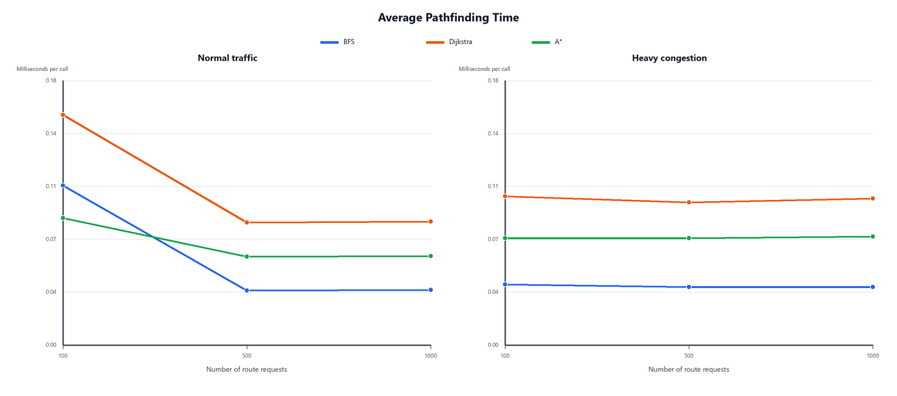
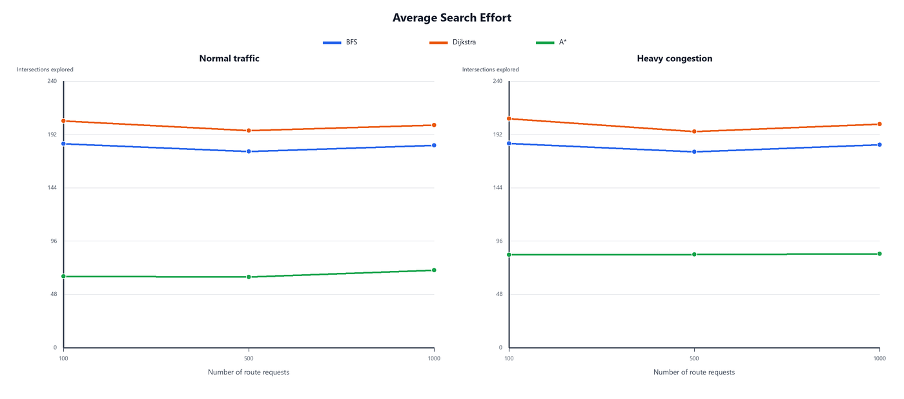
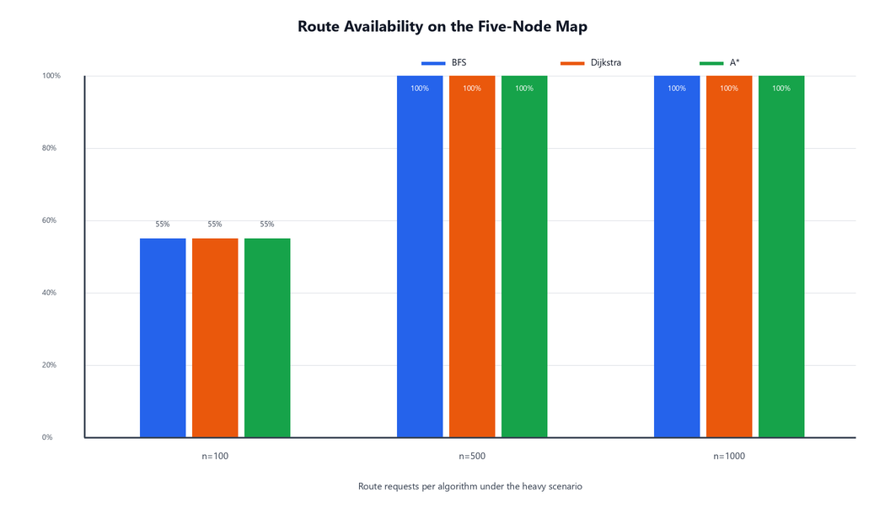
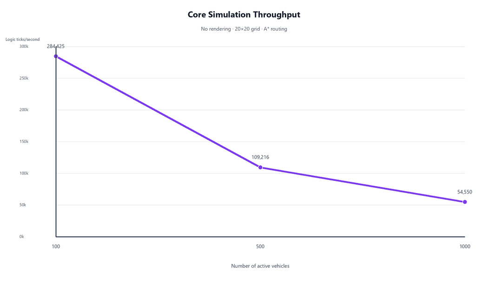

# Experiment Results: Pathfinding and Simulation Stress Tests

## Overview

This document evaluates three route-planning strategies used by the Urban Traffic Simulator:

- **BFS**, which minimizes the number of roads in a route.
- **Dijkstra**, which minimizes the configured travel-time cost and accounts for congestion.
- **A-star**, which uses the same cost model as Dijkstra together with an admissible heuristic to reduce the search space.

The experiments address two questions:

1. How do BFS, Dijkstra, and A-star compare in computation time, search effort, route cost, and route availability?
2. How does the simulation core scale from 100 to 1,000 active vehicles when rendering is excluded?

The committed experiment artifacts are:

- [Pathfinding measurements](bench_results.csv)
- [Simulation-throughput measurements](throughput_results.csv)
- [Benchmark harness](stress_test.cpp)
- [Chart-generation script](make_charts.py)

All values reported below come directly from the two committed CSV files.

## 1. Experimental Setup

### 1.1 Test graphs

Two directed graphs were used:

| Graph | Size | Purpose |
|---|---:|---|
| Five-node map | 5 intersections, 6 roads | A small sanity-check graph embedded in the benchmark harness |
| Synthetic 20×20 grid | 400 intersections, approximately 1,520 directed roads | A larger search space suitable for comparing the algorithms at 100, 500, and 1,000 route requests |

The synthetic grid contains a directed road in each direction between adjacent cells. It is an artificial benchmark graph and is not one of the JSON maps used by the interactive application.

### 1.2 Traffic scenarios

Each graph was evaluated under two conditions:

- **Normal:** every road has a congestion multiplier of 1.0 and no additional road is blocked.
- **Heavy:** approximately 35% of roads receive a congestion multiplier between 3.0 and 6.0, and approximately 5% are blocked.

The benchmark uses the fixed random seed `2026`. This makes a complete run deterministic. However, the origin/destination pairs and heavy-traffic configuration are regenerated for each request count. Comparisons across 100, 500, and 1,000 requests therefore include both workload-size and scenario differences.

### 1.3 Measurements

For each origin/destination pair, the harness calls the selected strategy's `findPath()` method through `StatisticsManager::measurePathfinding()`, which uses `std::chrono::steady_clock`.

The recorded pathfinding metrics are:

- average computation time per call;
- average number of intersections explored;
- number of routes found and not found;
- average path cost.

For Dijkstra and A-star, path cost represents the travel-time cost used by the routing model. BFS minimizes road count, so its path-cost values are hop counts and should not be compared numerically with the time-based costs of Dijkstra or A-star.

The throughput experiment creates 100, 500, or 1,000 vehicles on the 20×20 grid, uses A-star routing, and measures 300 consecutive calls to `TrafficSimulator::update()`. It excludes SFML rendering, UI processing, and draw calls. The reported “logic ticks per second” measure core simulation throughput, not visible application frame rate.

## 2. Pathfinding Computation Time



The following table shows the 1,000-request result on the synthetic grid:

| Algorithm | Normal | Heavy |
|---|---:|---:|
| BFS | 0.0376 ms | 0.0395 ms |
| Dijkstra | 0.0840 ms | 0.0996 ms |
| A-star | 0.0606 ms | 0.0738 ms |

BFS is the fastest because it minimizes hop count and does not evaluate the weighted travel-time objective. Dijkstra is the slowest because it explores the weighted graph without heuristic guidance. At 1,000 requests, A-star is approximately **27.8% faster than Dijkstra under normal traffic** and **25.9% faster under heavy traffic**.

The 100-request timings are less stable than the larger samples and include start-up and short-run measurement effects. The 1,000-request rows provide the more useful comparison. Absolute times are machine-dependent; the relative behavior is the main result.

## 3. Search Effort



At 1,000 route requests:

| Algorithm | Normal | Heavy |
|---|---:|---:|
| BFS | 182.2 intersections | 182.7 intersections |
| Dijkstra | 200.5 intersections | 201.2 intersections |
| A-star | 69.7 intersections | 84.4 intersections |

A-star explores substantially fewer intersections than Dijkstra while returning the same average weighted path cost. Relative to Dijkstra, A-star explores approximately **65.2% fewer intersections under normal traffic** and **58.0% fewer under heavy traffic**.

The reduction is smaller in the heavy scenario because congestion and blocked roads make the geometric heuristic less representative of the final travel-time cost. Even so, A-star retains a clear search-effort advantage.

## 4. Route Availability on the Five-Node Graph



| Route requests | BFS | Dijkstra | A-star |
|---:|---:|---:|---:|
| 100 | 55% | 55% | 55% |
| 500 | 100% | 100% | 100% |
| 1,000 | 100% | 100% | 100% |

The graph-construction helper initially marks one road as blocked, but the benchmark resets every road before applying each scenario. In the 100-request heavy scenario, the deterministic random configuration blocks a critical connection, leaving only 55 of 100 sampled origin/destination pairs reachable. The heavy configurations generated for the 500- and 1,000-request cases do not disconnect the sampled routes.

All three algorithms report the same route availability for a given graph state. This is expected: algorithm choice changes the objective and search efficiency, but it cannot create a route when the directed graph is disconnected.

Because a new heavy configuration is generated for each request count, this chart should not be interpreted as evidence that adding requests improves connectivity. It documents three deterministic benchmark cases with different randomized road conditions.

## 5. Weighted Route Cost

For 1,000 requests on the five-node graph:

| Algorithm | Normal | Heavy | Change |
|---|---:|---:|---:|
| BFS | 2.22 hops | 2.22 hops | No change in hop count |
| Dijkstra | 4.75 s | 11.61 s | +144% |
| A-star | 4.75 s | 11.61 s | +144% |

Dijkstra and A-star produce the same average weighted cost in every corresponding row of the committed results. This supports the intended behavior: A-star reduces search effort without changing the optimum found under the shared cost model.

BFS values use a different unit and objective. Its unchanged hop count does not mean that the chosen route has unchanged real travel time; BFS does not optimize for congestion.

## 6. Core Simulation Throughput



| Active vehicles | Average time per logic tick | Logic ticks per second |
|---:|---:|---:|
| 100 | 0.0035 ms | 284,425 |
| 500 | 0.0092 ms | 109,216 |
| 1,000 | 0.0183 ms | 54,550 |

Core-update cost increases approximately with the number of active vehicles. At 1,000 vehicles, the measured update takes about **0.018 ms**, roughly **0.11% of a 16.67 ms frame budget at 60 FPS**.

This result indicates that the measured simulation-update loop is inexpensive in this benchmark. It does **not** prove that the complete graphical application will maintain 60 FPS at 1,000 vehicles: rendering, sprite management, UI work, GPU/driver overhead, and the graphics environment are excluded from this test.

## 7. Conclusions

- **BFS** has the lowest computation time when the objective is the fewest road segments, but it does not optimize travel time or congestion.
- **Dijkstra** finds the optimal congestion-aware route under the configured cost model, but explores the most intersections in these experiments.
- **A-star** matches Dijkstra's weighted route cost while exploring substantially fewer intersections and completing faster on the 20×20 grid.
- Blocked roads affect route availability equally for all three correct algorithms.
- The measured core simulation loop scales comfortably to 1,000 vehicles, but graphical frame rate must be evaluated separately.

For this project, A-star offers the strongest balance between weighted-route quality and search efficiency. Dijkstra remains a useful reference for validating optimal cost, while BFS provides a simple unweighted baseline.

## 8. Reproducing and Auditing the Results

### Regenerate the charts

The charts can be recreated from the committed CSV files without rerunning the benchmark:

```bash
cd docs
python3 -m pip install pandas matplotlib
python3 make_charts.py
```

On Windows, use `python` instead of `python3` if that is the name of the installed Python command.

The script writes:

- `chart_time_grid.png`
- `chart_nodes_grid.png`
- `chart_realmap_found.png`
- `chart_throughput.png`

### Inspect the benchmark

The benchmark implementation is available in [`docs/stress_test.cpp`](stress_test.cpp). It records the deterministic seed, graph construction, traffic randomization, metric collection, and CSV output format.

The benchmark harness is not registered as a target in the project's standard `CMakeLists.txt`. Therefore, the normal application build and its eight CTest tests do not rerun this experiment automatically. Reviewers can audit the method and regenerate every chart from the committed raw data without modifying the project build.

## 9. Limitations

- Timing results depend on compiler settings, hardware, operating system, and background load.
- The benchmark records one deterministic run rather than confidence intervals from repeated independent runs.
- Heavy-traffic road conditions are regenerated for each request count, so scaling comparisons are not performed on an identical graph state.
- The 20×20 graph is synthetic and does not represent every structural property of the included city maps.
- The throughput result excludes rendering and should not be reported as application FPS.
